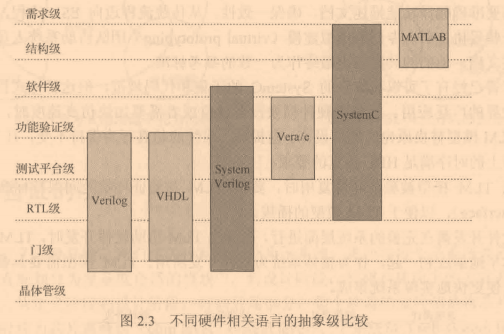

# System Verilog与功能验证

## 功能验证技术与方法学概要

## 验证重用与验证方法学

# 芯片验证漫游指南

## 芯片验证全视

### 功能验证简介
* 前端仿真 
    指RTL仿真，没有延时情况进行功能验证
* 后端仿真 
    指门级仿真，考虑延时。包括：
    - 零延时(zero delay)仿真
    - 单位延时(unit delay)
    - SDF(Standard Delay Format)仿真

### 验证的处境
* 验证的两大挑战
    - 如何穷尽所有可能的情况给设计产生激励(输入)
    - 如何在各种可能的激励情况下判断出不符合硬件描述的行为并报告出来(输出)
* 验证的5个维度
    - 完备性
    - 复用性
    - 高效性
    - 高产出
    - 代码性能

## 验证的策略
### 设计的流程
* ESL(Electronic System Level)系统设计流程 
    ESL通过简历虚拟原型“TLM模型”，使参与到系统开发的如下阶段可以并行开发。
    - 结构定义
    - 硬件设计
    - 硬件验证
    - 软件开发
* 不同硬件相关语言的抽象级比较

### 验证的层次
* 模块级(block level / unit level)
* 子系统级(sub-system level)
* 芯片系统级(chip level)
* 硅后系统级(post-silicon system level)

## 验证的方法
### 验证方法分类
* 动态仿真(dynamic simulation)
* 静态检查(formal check)
* 虚拟模型(virtual prototype)
* 硬件加速(hardware acceleration)
* 电源功耗(power consumption)
* 性能评估(performance evaluation)

### 动态仿真
通过测试序列和激励生成器给带验设计适当的激励，随着仿真的推进，判断输出是否符号预期。
按照激励生成方式和检查方式，可将动态仿真分为：
* 定向测试(directed test)
* 随机测试(random test)
* 参考模型检查(reference model check)
* 断言检查(assertion check)

# UVM实战

## 验证的语言
* Verilog 
用于验证的子集，如`initial`、`task`和`function`。缺点：在功能模块化、随机化验证上存在不足
* SystemC 
是一个C++的库，建立参考模型(reference model)。缺点：需要自行内存管理
* SystemVerilog 
优点：提供内存管理机制

## UVM环境配置
* 基于Modelsim搭建UVM环境，参考：[UVM环境配置](UVM环境配置.md)
* `UMV Class`例子，参考：[UVM Class](./code/uvm-class/hello.sv)