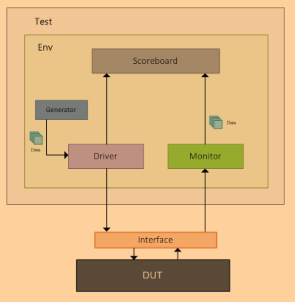
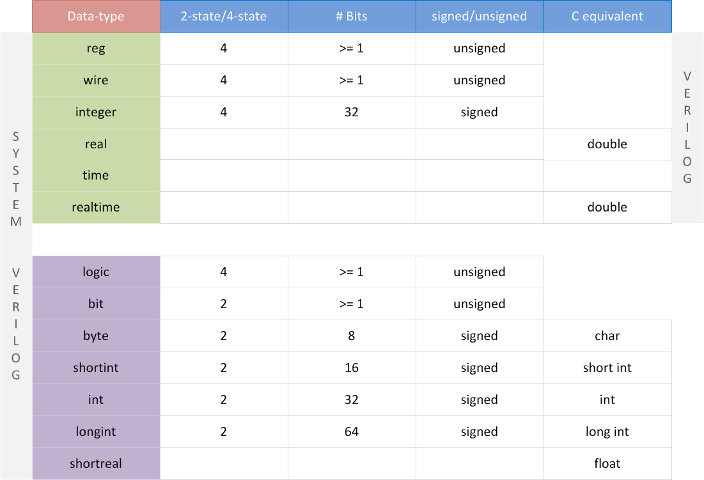

# 概述
本文是[SystemVerilog Tutorial](https://www.chipverify.com/systemverilog/systemverilog-tutorial)的学习笔记。最终目标是在Modelsim中将[Testbench Example](https://www.chipverify.com/systemverilog/systemverilog-testbench-example-1)跑起来。

# SystemVerilog TestBench
## 什么是Verilog仿真？
* 在不同时间，不同激励下，验证RTL代码的行为
* [例子](./code/simulation/hello.sv)：在Modelsim中跑一个简单的"SystemVerilog testbench"
* 仿真中的一些术语：
    - update event
    - evaluation event
    - event queue
    - simulation time
    - event regions
这些都是为了解决仿真中有可能出现的竞争问题。

## SystemVerilog如何应用与芯片验证中？
* 芯片设计通常由多个verilog文件组成，包括一个`top module`和多个子模块。这些verilog设计的功能需要被`testbench`验证，而`testbench`通常由SystemVerilog编写而成。
* 因此，testbench需要实例化`top module`，并提供各种激励，验证模块的输出是否正确。
* [例子 simple-tb](./code/simple-tb/tb_top.sv): `tb_top`是SystemVerilog编写的testbench，用于测试Verilog编写的D触发器["d_ff.v"](./code/simple-tb/d_ff.v)。

## 创建testbench的目的是什么？
通过仿真手段验证待测设计的功能。
* testbench的组成
    - Generator 
    生成各种激励以驱动被测电路
    - Interface 
    接口包括了需要被驱动或者被观测的信号
    - Driver 
    驱动激励到被测电路
    - Monitor 
    检测输入输出信号
    - Scoreboard 
    比较输出信号和期望值
    - Environment 
    包括以上所有的测试组件
    - Test 
    包括所有的测试环境

## 什么是DUT？
* DUT全称"Design Under Test"，是被测的硬件电路。在仿真测试中，DUT也称为DUV，即"Design Under Verification"。
* [例子 dut.v](./code/testbench/dut.v)

## 什么是interface？
* 当DUT的端口非常复杂时，可通过定义interface抽象出测试关心的输入输出端口。
* [例子 interface.sv](./code/testbench/interface.sv)

## 什么是driver？
* driver定义了一个task用于驱动输入信号到被测电路，可被其他模块调用。
* [例子 driver.sv](./code/testbench/driver.sv)

## driver如何实现驱动？
* generator生成有效的数据([data transaction](./code/testbench/data.sv))给driver，driver再将数据传输到被测电路。
* 例子"testbench"中并没有generator，generator的行为被放入了test组件。

## 为什么需要monitor？
* driver会将数据输入给DUT执行，monitor会获取DUT的输出信号，并将其传给scoreboard和期望数据做比较。
* [例子 monitor.sv](./code/testbench/scoreboard.sv)

## scoreboard的目的是什么？
* scoreboard内部有一个和DUT行为一样的`reference model`。driver输入给DUT的信号同时会输入给scoreboard，此输入经过scoreboard中的`reference model`会产生DUT的期望输出。`reference model`的输出应该和monitor传过来的数据一致，否则测试失败。
* [例子 scoreboard.sv](./code/testbench/scoreboard.sv)

## 为什么需要environment？
* environment组件是为了增加testbench的可扩展性，可在其中加入更过其他的组件。
* [例子 environment.sv](./code/testbench/environment.sv)

## test组件是做什么的？
* test会实例化一个environment组件，并实施配置。

## testbench流程是如何的？
* Generator -> Driver -> Interface -> Design -> Interface -> Monitor -> Scoreboard

# SystemVerilog Data Types

## event
* trigger event: `->` or `->>`
* wait for an event: `@` or `.triggered`
* [例子：event](./code/event/tb.sv)