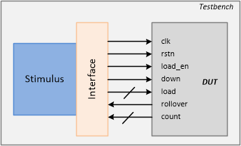
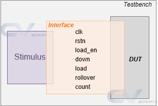
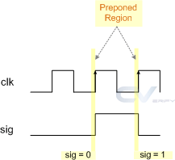
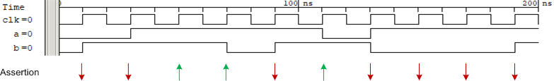

# 概述
本文是[SystemVerilog Tutorial](https://www.chipverify.com/systemverilog/systemverilog-tutorial)的学习笔记。最终目标是在Modelsim中将[Testbench Example](https://www.chipverify.com/systemverilog/systemverilog-testbench-example-1)跑起来。

# SystemVerilog TestBench
## 什么是Verilog仿真？
* 在不同时间，不同激励下，验证RTL代码的行为
* [例子](./code/simulation/hello.sv)：在Modelsim中跑一个简单的"SystemVerilog testbench"
* 仿真中的一些术语：
    - update event
    - evaluation event
    - event queue
    - simulation time
    - event regions
这些都是为了解决仿真中有可能出现的竞争问题。

## SystemVerilog如何应用与芯片验证中？
* 芯片设计通常由多个verilog文件组成，包括一个`top module`和多个子模块。这些verilog设计的功能需要被`testbench`验证，而`testbench`通常由SystemVerilog编写而成。
* 因此，testbench需要实例化`top module`，并提供各种激励，验证模块的输出是否正确。
* [例子 simple-tb](./code/simple-tb/tb_top.sv): `tb_top`是SystemVerilog编写的testbench，用于测试Verilog编写的D触发器["d_ff.v"](./code/simple-tb/d_ff.v)。

## 创建testbench的目的是什么？
通过仿真手段验证待测设计的功能。
* testbench的组成
    - Generator<br>
    生成各种激励以驱动被测电路
    - Interface<br>
    接口包括了需要被驱动或者被观测的信号
    - Driver<br>
    驱动激励到被测电路
    - Monitor<br>
    检测输入输出信号
    - Scoreboard<br>
    比较输出信号和期望值
    - Environment<br>
    包括以上所有的测试组件
    - Test<br>
    包括所有的测试环境


## 什么是DUT？
* DUT全称"Design Under Test"，是被测的硬件电路。在仿真测试中，DUT也称为DUV，即"Design Under Verification"。
* [例子 dut.v](./code/testbench/dut.v)

## 什么是interface？
* 当DUT的端口非常复杂时，可通过定义interface抽象出测试关心的输入输出端口。
* [例子 interface.sv](./code/testbench/interface.sv)

## 什么是driver？
* driver定义了一个task用于驱动输入信号到被测电路，可被其他模块调用。
* [例子 driver.sv](./code/testbench/driver.sv)

## driver如何实现驱动？
* generator生成有效的数据([data transaction](./code/testbench/data.sv))给driver，driver再将数据传输到被测电路。
* 例子"testbench"中并没有generator，generator的行为被放入了test组件。

## 为什么需要monitor？
* driver会将数据输入给DUT执行，monitor会获取DUT的输出信号，并将其传给scoreboard和期望数据做比较。
* [例子 monitor.sv](./code/testbench/scoreboard.sv)

## scoreboard的目的是什么？
* scoreboard内部有一个和DUT行为一样的`reference model`。driver输入给DUT的信号同时会输入给scoreboard，此输入经过scoreboard中的`reference model`会产生DUT的期望输出。`reference model`的输出应该和monitor传过来的数据一致，否则测试失败。
* [例子 scoreboard.sv](./code/testbench/scoreboard.sv)

## 为什么需要environment？
* environment组件是为了增加testbench的可扩展性，可在其中加入更过其他的组件。
* [例子 environment.sv](./code/testbench/environment.sv)

## test组件是做什么的？
* test会实例化一个environment组件，并实施配置。

## testbench流程是如何的？
* Generator -> Driver -> Interface -> Design -> Interface -> Monitor -> Scoreboard

# SystemVerilog Data Types


# SystemVerilog Interprocess Communication
Methods    | Description
-----------| -----------
Events     | Different threads synchronize with each other via event handles in a testbench
Semaphores | Different threads might need to access the same resource; they take turns by using a semaphore
Mailbox    | Threads/Components need to exchange data with each other; data is put in a mailbox and sent

## Events
* trigger event: `->eventA` or `->>eventA`
* wait for an event: `@eventA` or `wait(eventA.triggered)`
* [例子：event](./code/event/tb.sv)

## Semaphores
* 用于资源互斥保护，类似C++中的`mutex`
* [例子：semaphore](./code/semaphore/tb.sv)
    * 注：例子中的`task`不加`begin..end`和加上，结果是一样的

## Mailbox
* 用于多线程间数据交换，`mailbox`的`put`和`get`是线程安全的
* [例子：mailbox](./code/mailbox/tb.sv)
    * 注：从例子的结果中可看出，同一时刻，mailbox的`get`总是先发生与`put`

# SystemVerilog接口
## SystemVerilog接口和Verilog接口有什么不同？
* Verilog接口

```systemVerilog
// Module
module counter_ud 
  #(parameter WIDTH = 4)
  ( 
  input           clk,
  input           rstn,
  input wire [WIDTH-1:0]  load,
  input           load_en,
  input           down,
  output           rollover,
  output reg [WIDTH-1:0]  count 
);
  ...
endmodule
// Interface
interface cnt_if #(parameter WIDTH = 4) (input bit clk);
  logic       rstn;
  logic       load_en;
  logic [WIDTH-1:0] load;
  logic [WIDTH-1:0] count;
  logic       down;
  logic       rollover;
endinterface
// TB
module tb;
  ...
  cnt_if     cnt_if0 (clk);
  // Connection
  counter_ud  c0 (   .clk     (cnt_if0.clk),
                    .rstn     (cnt_if0.rstn),
                    .load     (cnt_if0.load),
                    .load_en   (cnt_if0.load_en),
                    .down     (cnt_if0.down),
                    .rollover   (cnt_if0.rollover),
                    .count     (cnt_if0.count));
endmodule
```

* SystemVerilog接口

```systemVerilog
// Module defined with interface
module counter_ud  #(parameter WIDTH = 4) (cnt_if _if);
  ...
endmodule
// TB
module tb;
  reg clk;
  always #10 clk = ~clk;
  cnt_if     cnt_if0 (clk);
  // Note that here we just have to pass the interface handle
  // to the design instead of connecting each individual signal
  counter_ud  c0 (cnt_if0);
  // Can use implicit port connection when all port signals have same name
  counter_ud  c1(.*);
  ...
endmodule
```

# SystemVerilog Assertions
## Assertion检测的目的
* 检测设计的某一属性是否有期望的输出值(expect value)
* 检测设计的某一属性是否出现了禁止出现的行为(exception)

## 为什么要引入Assertions语法？
通过以下两种写法，可以发现Assertions语法简化了代码：
* 不用assert语句
```verilog
// A property written in Verilog/SystemVerilog
always @ (posedge clk) begin
  if (!(a && b))
    $display ("Assertion failed");
end
```
* 用assert语句
```verilog
// The property above written in SystemVerilog Assertions syntax
assert property(@(posedge clk) a && b);
```
* assert syntax
```verilog
// Simple assert statement  
assert(<expression>);
 
// Assert statement with statements to be executed for pass/fail conditions
assert(<expression>) begin
  // If condition is true, execute these statements
end else begin
  // If condition is false, execute these statements
end
 
// Optionally give name for the assertion
[assert_name] : assert(<expression>);
```

## 断言块
* Sequence断言块
```verilog
// Sequence syntax
sequence <name_of_sequence>
  <test expression>
endsequence
 
// Assert the sequence
assert property (<name_of_sequence>);
```
* Property断言块
```verilog
// Property syntax
property <name_of_property>
  <test expression> or
  <sequence expressions>
endproperty
 
// Assert the property
assert property (<name_of_property>);
```

## 断言种类
两种断言：`Immediate Assertion`和`Concurrent Assertions`
### Immediate Assertion
* Syntax
```verilog
always @ (<some_event>) begin
    ...
    // This is an immediate assertion executed only
    // at this point in the execution flow
    assert(!fifo_empty);      // Assert that fifo is not empty at this point
    ...
end
```
* [例子: Immediate Assertion](./code/iassert/iassert.sv)
### Concurrent Assertions
* Syntax
```systemVerilog
// Define a property to specify that an ack signal should be 
// returned for every grant signal within 1:4 clocks
property p_ack;
  @(posedge clk) gnt ##[1:4] ack;
endproperty
 
assert property(p_ack);    // Assert the given property is true always
```
* [例子：Concurrent Assertion](./code/cassert/tb.sv)
    * 注：在同一仿真时间，assert动作发生在`non-Blocking`语句之前，这和`$display`的行为是一致的

