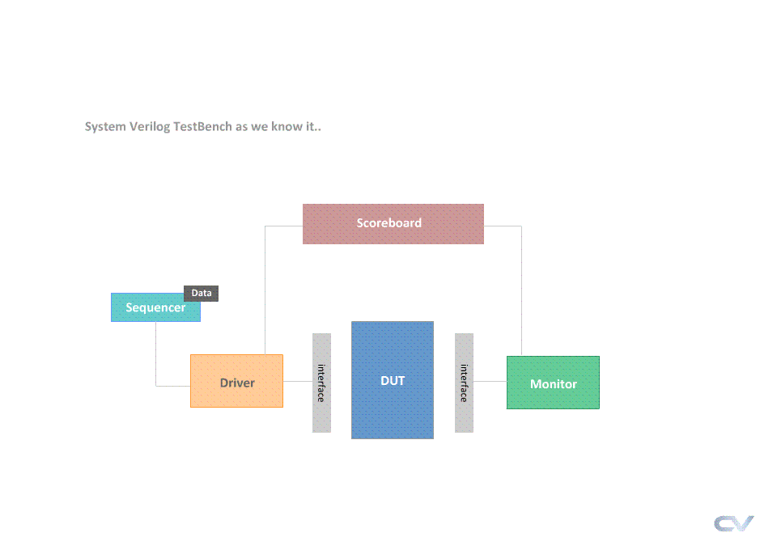
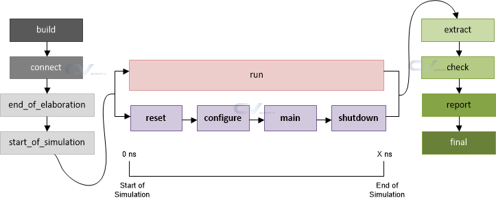
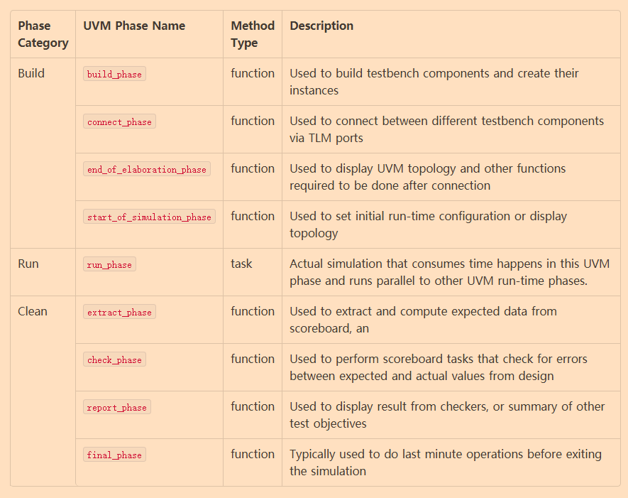

# 概述
本文是[UVM Tutorial](https://www.chipverify.com/uvm/uvm-tutorial)的学习笔记。

# UVM TestBench 和 SystemVerilog TestBench 对比

* [DUT](./code/uvm-tb/dut_wrapper.sv)
    - 被测试电路，接口由interface定义
* [Interface](./code/uvm_tb/dut_if.sv)
    - 接口定义，所有组件和DUT交流，都通过此interface
* [Environment](./code/uvm_tb/my_pkg.sv)
    - 测试的环境组件，会在其中创建所有相关组件，包括：Driver, Monitor, Scoreboard等
* [Test](./code/uvm_tb/test_pkg.sv)
    - 配置测试，此组件会实现各种测试的不同配置
* [Top](./code/uvm_tb/tb_top.sv)
    - top level module, 启动测试

# UVM Phase
* UVM各阶段是为了控制整个仿真流程同步机制而存在的，大致分为三个阶段：
    - Build time phases
    - Run time phases
    - Clean-Up phases

* [例子：Phases](./code/phases/my_pkg.sv)
    - Build Phase (top to bottom)
    - Connect Phase (bottom to top)
    - End of Elaboration Phase (bottom to top)
    - Start Of Simulation Phase (bottom to top)
    - Parallel Phases with Run Phase
        - Reset Phase (top to bottom)
        - Configure Phase (top to bottom)
        - Main Phase (top to bottom)
        - Shutdown Phase (bottom to top, start after Run Phase)
    - Run Phase
    - Extract Phase (bottom to top)
    - Check Phase (bottom to top)
    - Final Phase (top to bottom)